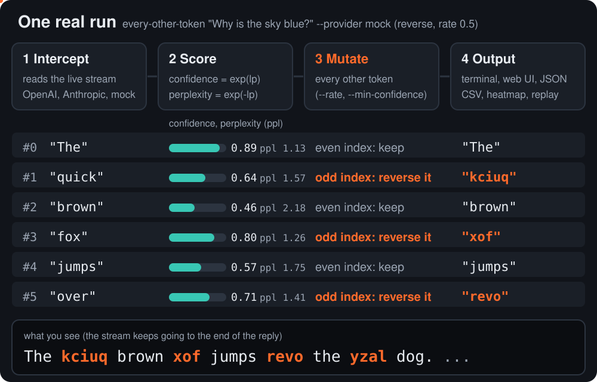
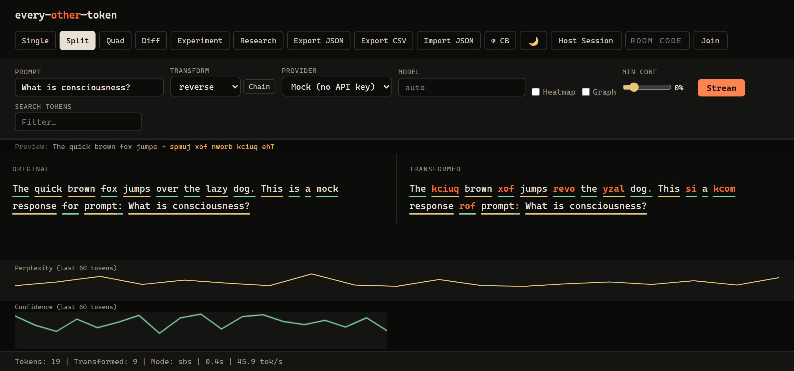

<p align="center">
  <a href="https://every-other-token.vercel.app/"></a>
</p>

<h1 align="center">every-other-token</h1>

<p align="center"><b>看清 AI 大模型对自己写下的每一个词有多大把握，还能在它边写边输出的时候改掉它的词。</b></p>

<p align="center"><a href="README.md">English</a> | 简体中文 | <a href="README.ja.md">日本語</a> | <a href="README.ko.md">한국어</a></p>

<p align="center">
  <a href="https://gitlab.com/mattbusel/Every-Other-Token/-/releases/permalink/latest/downloads/every-other-token-windows-x86_64.exe"><b>下载 Windows 版 (.exe)</b></a> &nbsp;&middot;&nbsp;
  <a href="#install">Linux 和 macOS</a> &nbsp;&middot;&nbsp;
  <a href="https://every-other-token.vercel.app/">项目主页</a> &nbsp;&middot;&nbsp;
  <a href="#documentation">文档</a>
</p>

<p align="center">
  <a href="https://crates.io/crates/every-other-token"></a>
  <a href="https://docs.rs/every-other-token"></a>
</p>

**直接在浏览器里试用，无需安装，也不用 API key：**[every-other-token.vercel.app/play](https://every-other-token.vercel.app/play/)。输入一段提示词（prompt），就能看到每隔一个 token 被反转后输出。

`every-other-token` 是一款免费的大模型（LLM）token 流查看与拦截工具，支持命令行和浏览器。它接入 OpenAI、Anthropic、Gemini、OpenRouter 或你本机上的模型（Ollama、llama.cpp、vLLM、LM Studio）的实时流式输出，根据 logprobs 显示每个词元（token）的置信度和困惑度（perplexity），还能在 token 到达时改写每隔一个 token（或任意比例）。内置的 mock 模拟提供方让你不需要 API key 就能体验全部功能。

**适合谁用**：所有好奇语言模型如何选词的人，以及从事大模型可解释性研究、红队测试和提示词工程的开发者。

## 工作原理



1. **拦截**。它自己建立与模型的流式连接（SSE），因此每个数据块一到达就能看到。
2. **打分**。每个 token 都会得到 `confidence = exp(logprob)` 和 `perplexity = exp(-logprob)`，以及模型考虑过的其他候选词。
3. **变换**。被选中的 token（默认每隔一个，或者只选模型没把握的那些）会经过一种变换：反转、大写、加噪声、删除、同义词替换等等。
4. **输出**。你可以在终端里观看（普通模式，或用 `--tui` 打开全屏视图），也可以在 Web 界面里看，或者保存为 JSON lines、CSV 或 HTML 热力图。

<a id="install"></a>
## 安装

**Linux**（x86_64，Ubuntu 20.04+ / Debian 11+）。一行命令，无任何依赖，安装到 `~/.local/bin`：

```sh
mkdir -p ~/.local/bin && curl -fsSL https://gitlab.com/mattbusel/Every-Other-Token/-/releases/permalink/latest/downloads/every-other-token-linux-x86_64.tar.gz | tar xz --strip-components=1 -C ~/.local/bin --wildcards '*/every-other-token'
```

| 其他系统 | |
|---|---|
| **Windows** | [下载 every-other-token-windows-x86_64.exe](https://gitlab.com/mattbusel/Every-Other-Token/-/releases/permalink/latest/downloads/every-other-token-windows-x86_64.exe) 后直接运行。（程序未签名，SmartScreen 可能会弹出提示：点击*更多信息*，再点*仍要运行*。） |
| **macOS，或从源码安装** | `cargo install --locked every-other-token` |

双击 Windows 的 .exe，Web 界面就会在浏览器中打开。所有发布版本及其 SHA-256 校验值见：[Releases](https://gitlab.com/mattbusel/Every-Other-Token/-/releases)。

## 示例

下面全部是 mock 提供方的真实输出（固定的回复和固定的 logprobs，跑的是真实的处理流程），所以不用 API key 也能原样复现。

**1. 每隔一个 token 反转一次**（默认行为）

```console
$ every-other-token "Why is the sky blue?" --provider mock
The kciuq brown xof jumps revo the yzal dog. This si a kcom response rof prompt: Why si the yks blue?
24 tokens streamed, 12 transformed
```

**2. 只改写模型没把握的词**（置信度小于等于 0.6）

```console
$ every-other-token "Why is the sky blue?" uppercase --provider mock --rate 1 --min-confidence 0.6
The quick BROWN fox JUMPS over the LAZY dog. THIS is a mock response for PROMPT: WHY IS THE SKY BLUE?
24 tokens streamed, 11 transformed
```

"brown"（0.46）、"jumps"（0.57）、"lazy"（0.41）、"This"（0.54）和 "prompt"（0.59）低于阈值。末尾回显的提示词在 mock 中不带 logprobs，因此退回到普通的比例规则。

**3. 以 JSON 格式获取数据，每个 token 一行**

```console
$ every-other-token "Why is the sky blue?" uppercase --provider mock --json-stream
{"text":"The","original":"The","index":0,"transformed":false,"importance":0.8869204521179199,"confidence":0.88692045,"perplexity":1.1274968,"is_error":false,"arrival_ms":0}
{"text":" QUICK","original":" quick","index":1,"transformed":true,"importance":0.6376281380653381,"confidence":0.63762814,"perplexity":1.5683122,"is_error":false,"arrival_ms":0}
...
```

**4. 在终端里全屏观看**，运行 `every-other-token "Why is the sky blue?" --provider mock --tui`。回复会按置信度着色流式输出（绿色表示有把握，黄色表示不确定，红色表示在猜），被改写的 token 带下划线，侧边面板显示实时统计、置信度迷你走势图，以及模型对最新一个 token 考虑过的其他候选词。按 `q` 退出，回复内容会保留在终端里。

**5. 在你本机的模型上运行**。只要 [Ollama](https://ollama.com) 在运行，`every-other-token "Why is the sky blue?" --provider ollama` 就会从 `llama3.2` 流式输出，不需要 API key。任何兼容 OpenAI API 的服务也都可以：`every-other-token "Why is the sky blue?" reverse my-model --base-url http://localhost:8080/v1`。

**6. 在浏览器里观看**，运行 `every-other-token --web --provider mock`（或者直接双击 .exe）。分屏视图：左边是原始流，右边是改写后的流，每个 token 下方的下划线表示它的置信度。



## 不用 API key 也能拿到精确概率：`--provider local`

托管的 API 要么根本不返回 token 概率（Anthropic、Gemini），要么无法告诉你提示词中哪些词起了作用。而在工具内部运行的模型两件事都能做到。用 `local` feature 编译后，它会下载一次 SmolLM2-135M-Instruct（269 MB，存到你的缓存目录），并借助 [candle](https://github.com/huggingface/candle) 在 CPU 上运行：

```sh
cargo install every-other-token --features local
every-other-token "Reply with only the city name. Capital of France?" --provider local --attribute
```

真实输出：

```text
The latipac of ecnarF is siraP.
How much the reply depended on each prompt word (drop in total log-probability when the word is removed):
    Reply   +1.432  #########
     with   +1.108  #######
     only   +1.875  ############
      the   +0.357  ##
     city   +3.499  ######################
    name.   +0.932  ######
  Capital   +3.229  #####################
       of   +0.857  #####
  France?   +4.689  ##############################
```

每个 token 都带有精确的对数概率（log-probability）和模型真实的前 5 个候选词，在终端、`--tui`、Web 界面和所有导出格式里都能看到。`--attribute` 会逐个去掉提示词中的词，对同一段回复重新打分，并报告概率下降了多少（遮挡归因，occlusion attribution）。`--model` 可以换成 Hugging Face Hub 上其他 Llama 架构的模型，`--seed N` 则改用采样而不是贪心解码。

对于不返回概率的提供方（Anthropic、Gemini 以及许多本地服务），工具不显示置信度，而不是编造一个。

## 三步上手

1. **获取**。使用上面的 Linux 一行命令或 Windows .exe（或者 `cargo install`）。
2. **离线试用**。运行 `every-other-token "Why is the sky blue?" --provider mock`，或者双击 .exe，在提供方菜单中选择 **Mock (no API key)**。
3. **接入真实模型**。设置 `OPENAI_API_KEY` 或 `ANTHROPIC_API_KEY`（或 `OPENROUTER_API_KEY`、`GEMINI_API_KEY`），然后运行 `every-other-token "Why is the sky blue?" --visual`（终端，按置信度着色），加上 `--tui` 打开全屏视图，或者运行 `every-other-token --web`（浏览器）。用 `--provider openai|anthropic|ollama|openrouter|gemini` 选择提供方。真实的置信度数值来自 logprobs（OpenAI、OpenRouter、较新版本的 Ollama）；对于 Anthropic 和 Gemini 这类不返回 logprobs 的提供方，则根据每个 token 到达的快慢给出估计值。

运行 `every-other-token --help` 查看全部参数，示例在帮助信息的末尾。

<a id="documentation"></a>
## 文档

| 文档 | 内容 |
|---|---|
| [使用指南](docs/USAGE.md) | 所有变换方式、`--rate` 和 `--min-confidence`、系统提示词 A/B 测试、提供方对比、研究模式、Web 界面视图、配置文件、shell 补全、从源码构建 |
| [库参考](docs/REFERENCE.md) | CLI 背后的 Rust 模块（归因导出、漂移检测、变换实验室、因果图等），附示例 |
| [架构](docs/ARCHITECTURE.md) | 流、变换和输出是如何组合在一起的 |
| [HTTP API](docs/api.md) 和 [WebSocket 房间](docs/websocket.md) | Web 服务端点和多人协作编辑 token |
| [Feature 开关](docs/features.md) | 可选的 Cargo features |
| [docs.rs](https://docs.rs/every-other-token) | 作为库使用时的完整 API 文档 |
| [更新日志](CHANGELOG.md) 和 [贡献指南](CONTRIBUTING.md) | 版本历史，以及如何提交改动 |

## 许可证

MIT，见 [LICENSE](LICENSE)。

## 雇用作者

**你的产品也需要这类工程能力**？我会接少量客户项目：大模型（LLM）功能、iOS 应用和性能优化，固定报价。[服务与报价](https://mattbusel.vercel.app/) · [邮件](mailto:mattbusel@gmail.com) · [LinkedIn](https://www.linkedin.com/in/matthewbusel/)
